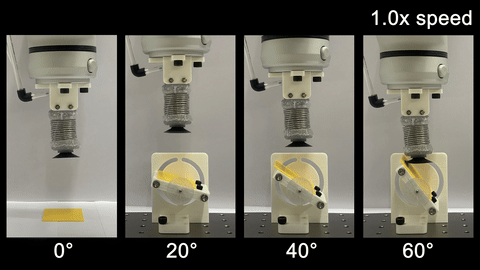

Hello! I am a Ph.D. candidate in the [Biorobotics Lab][BRL_link] at Seoul National University, working with Professor Kyu-Jin Cho, and I expect to graduate in February 2025. After graduation, I will work as a Postdoctorial Researcher at the [Soft Robotics Research Center (SRRC)][SRRC_link] at Seoul National University (SNU), continuing to work with Professor Kyu-Jin Cho in the Department of Mechanical Engineering.

You can find more details about me on my [About][About_link] page. Additionally, please visit my [Publications][Publication_link] page for more information about my research. For any inquiries, feel free to contact me via email: [jaemineom81@gmail.com][Email].

CV can be downloaded form [here][cv_link].

[BRL_link]: https://www.biorobotics.snu.ac.kr/
[SRRC_link]: https://www.srrc.snu.ac.kr
[About_link]: /about/
[Publication_link]: /publications/
[Email]: mailto:jaemineom81@gmail.com
[cv_link]: https://github.com/JaeminEom/JaeminEom.github.io/blob/main/assets/CV/Jaemin_Eom_CV.pdf

## Selected Publications (* denotes equal contribution.)

    <!-- 왼쪽 GIF -->
    

        
    

    <!-- 오른쪽 텍스트 -->
    

        <b>MOGrip: Gripper for multiobject grasping in pick-and-place tasks using translational movements of fingers</b> 
        <b>Jaemin Eom</b>, Sung Yol Yu, Woongbae Kim, Chunghoon Park, Kristine Yoonseo Lee, and Kyu-Jin Cho  
        <b>Science Robotics, 2024.</b>  
        <a href="https://www.science.org/doi/10.1126/scirobotics.ado3939" target="_blank">Paper</a> / 
        <a href="https://www.youtube.com/watch?v=qFD562zo4Vk" target="_blank">Video</a> / 
        <a href="https://jaemineom.github.io/Project_MOGrip/" target="_blank">Project Page</a>
    

    <!-- 왼쪽 GIF -->
    

        
    

    <!-- 오른쪽 텍스트 -->
    

        <b>Compliant Suction Gripper with Seamless Deployment and Retraction for Robust Picking against Depth and Tilt Errors</b> 
        Yuna Yoo*, <b>Jaemin Eom*</b>, MinJo Park, and Kyu-Jin Cho 
        <b>IEEE Robotics and Automation Letters, 2023.</b>  
        <a href="https://ieeexplore.ieee.org/document/10024348" target="_blank">Paper</a> / 
        <a href="https://www.youtube.com/watch?v=5f0qXYcE3nw" target="_blank">Video</a> / 
        <a href="https://jaemineom.github.io/Project_Chameleon/" target="_blank">Project Page</a>
    

[MOGrip Paper]: https://www.science.org/doi/10.1126/scirobotics.ado3939
[MOGrip Video]: https://www.youtube.com/watch?v=qFD562zo4Vk
[MOGrip Project Page]: https://jaemineom.github.io/Project_MOGrip/

[Chameleon Paper]: https://ieeexplore.ieee.org/document/10024348
[Chameleon Video]: https://www.youtube.com/watch?v=5f0qXYcE3nw
[Chameleon Project Page]: https://jaemineom.github.io/Project_Chameleon/

<!-- Hello! I am a Postdoctoral Researcher at the [MIT CSAIL][Lab_MIT_Link] working with Professor Daniela Rus, since Jan 2023. My current work at CSAIL is centered on the development of tendon-driven soft robots utilizing computational co-design framework. Before joining MIT, I was a Postdoctoral Researcher at [Soft Robotic Research Center (SRRC)][Lab_link] in Seoul National University (SNU), working with Professor Kyu-jin Cho (Department of Mechanical engineering, SNU). 

I believe the true allure of engineering is its ability to leverage technology to improve human lives. With this belief as my driving force, I am dedicated to developing assistive soft robots that can be used in the real world beyond the laboratory with my expertise that lies in three key areas: 1) under-actuation mechanisms, 2) tendon transmission, and 3) the design of soft robots. 

As a robot hardware designer, my primary focus revolves around answering the question: "What constitutes a good design for soft robot?" To address this question, I am currently directing my efforts towards developing: 1) a hybrid rigid-soft robot design approach, 2) a design framework that balances usability and functionality while minimizing the number of actuators required, and 3) a computational co-design approach.

I recognize that the successful development of practical assistive robots necessitates the convergence of multidisciplinary knowledge. Therefore, I am eagerly looking forward to collaborating with researchers from diverse fields to bring about these advancements.

You can check my detail informations on my [about][about_link] page; you can also find my bio [here][bio]. Further, please look for my [research][Research_link] page and [publication][publication_link] page for details of my research. For any inquires, you can reach me via email: [bckim@mit.edu][email].

CV can be downloaded from [here][cv_link]. 

[Lab_MIT_Link]: https://csail.mit.edu
[SRRC_link]: https://www.srrc.snu.ac.kr
[Research_link]: /research/
[publication_link]: /publications/
[Lab_link]: https://www.srrc.snu.ac.kr/
[about_link]: /about/
[cv_link]: https://github.com/bc-kim/bc-kim.github.io/blob/master/assets/CV/ByungchulKim-CV.pdf
[email]: mailto:bckim@mit.edu
[bio]: https://bc-kim.github.io/about/#bio -->
